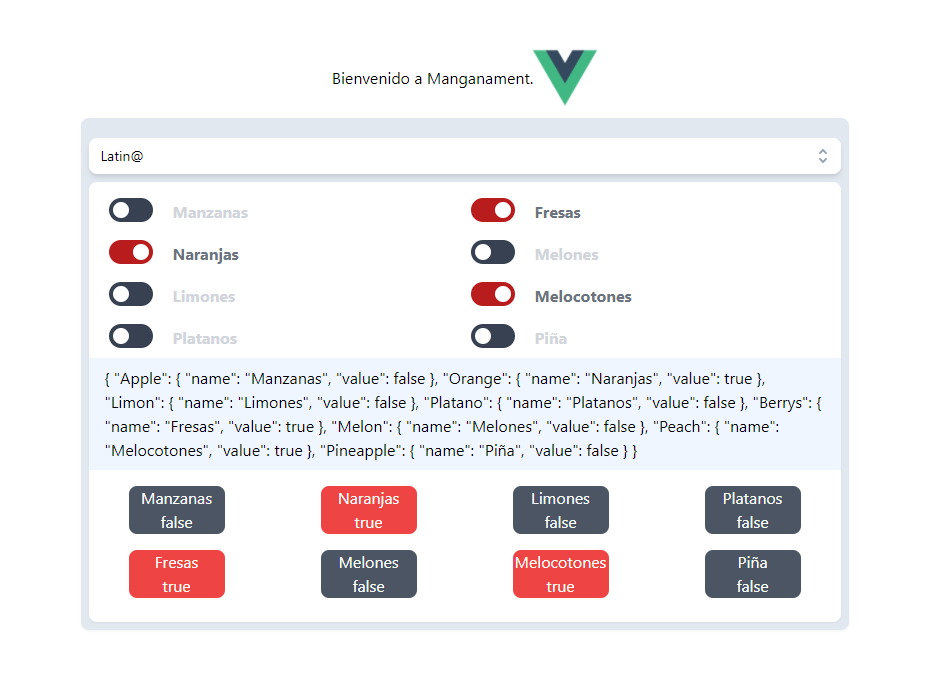

# Loop of VueJs 🧙‍♂️ 
# Ciclo de Vuejs 🧙‍♂️

## 
[es-CH]
<p>Contiene informacion sobre el uso del v-model y v-for para crear componentes/elementos dinamicos.</p>

[en-US]
<p>Contains information on the use of v-model and v-for to create dynamic components/elements.</p>

<div style="color: #f08010; font-weight: 900;">

## Componente Común:

</div>

[es-Ch]
### realizamos un recorrido de un atributo fruits que es un array de frutas

[en-US]
### we perform a loop of a fruits attribute which is an array of fruits

``` html
<template>
  <div>
    <!-- use tailwindcss vue -->
    <div class="w-2xl bg-blue-50 text-gray-400 font-bold">
      <!-- iteration is here -->
      <div v-for="fruit in fruits" :key="fruit">
        <label for="">{{ fruit.name }}</label>
        <!-- this can be a component example: @headlessui/vue-->
        <input v-model="fruit.value" type="checkbox">
      </div>
    </div>
    <div class="w-2xl bg-blue-50 text-gray-400 font-bold">
      {{fruits}}
    </div>
  </div>
</template>
```

[es-CH]
#### Como puede observar a continuación este componente es el comunmente realizariamos para manejar una lista input checkbox y validar que cada uno se active o desactive.

[en-US]
#### As you can see below, this component is the one we would commonly use to handle a list input box and validate that each one is activated or deactivated.

``` js
export default{

  setup() {
    // create refence with object for change
    // creamos una referencia con los objetos que van a cambiar
    const fruits = {
      oranges: {
        name: 'naranjas',
        value: false
      },
      apple: {
        name: 'manzanas',
        value: false
      },
      pear: {
        name: 'peras',
        value: false
      }
    };

    return {
      fruits
    };
  }
}

```

[es-CH]
### Este mentodo no actualiza el componente-atributo: 

[en-US]
### This method does not update the component-attribute


<br />
<div style="with:200px; background-color:#fff; heigth: 200px;">


</div>


Esto se soluciona creando una referencia al valor del html .

```` js
export default{

  import ref from 'vue'

  setup() {
    // create refence with object for change
    // creamos una referencia con los objetos que van a cambiar
    const fruits = ref({
      oranges: {
        name: 'naranjas',
        value: false
      },
      apple: {
        name: 'manzanas',
        value: false
      },
      pear: {
        name: 'peras',
        value: false
      }
    });

    return {
      fruits
    };
  }
}

````
<br />
<div style="with:200px; background-color:#fff; heigth: 200px;">


</div>
<br>
<hr>

### componente completo con la tecnologia de Vue 3 + Vite, tailwindcss 3, @headlessui/

<div style="with:200px; background-color:#fff; heigth: 200px;">



</div>
<br>

<hr>

#### email: wjgvm@live.com
### $ documento creado 12-02-2022

Puedes emplear la reactividad de un objeto intermedio y devolver un reactivo, mutable esto se encuentra en el manual referecial de VueJs en su sitio oficial.

You can use the reactivity of an intermediate object and return a reactive, mutable this is found in the VueJs reference manual on its official site.

[Vue $ref](https://vuejs.org/api/reactivity-core.html#ref)

