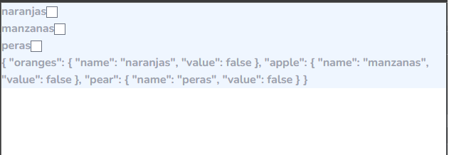
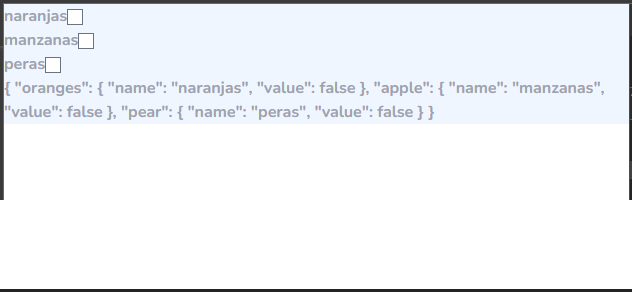

# Loop of VueJs 🧙‍♂️ 
# Ciclo de Vuejs 🧙‍♂️

## 

<p>Contiene informacion sobre el uso del v-model y v-for para crear componentes/elementos dinamicos.</p>

### Componente Común:
#### realizamos un recorrido de un atributo fruits que es un array de frutas

``` html
<template>
  <div>
    <!-- use tailwindcss vue -->
    <div class="w-2xl bg-blue-50 text-gray-400 font-bold">
      <!-- iteration is here -->
      <div v-for="fruit in fruits" :key="fruit">
        <label for="">{{ fruit.name }}</label>
        <!-- this can be a component example: @headlessui/vue-->
        <input v-model="fruit.value" type="checkbox">
      </div>
    </div>
    <div class="w-2xl bg-blue-50 text-gray-400 font-bold">
      {{fruits}}
    </div>
  </div>
</template>
```

#### Como puede observar a continuación este componente es el comunmente realizariamos para manejar una lista input checkbox y validar que cada uno se active o desactive.


``` js
export default{

  setup() {
    // create refence with object for change
    // creamos una referencia con los objetos que van a cambiar
    const fruits = {
      oranges: {
        name: 'naranjas',
        value: false
      },
      apple: {
        name: 'manzanas',
        value: false
      },
      pear: {
        name: 'peras',
        value: false
      }
    };

    return {
      fruits
    };
  }
}

```

### Este mentodo no actualiza el componente: 
<br />
<div style="with:200px; background-color:#fff; heigth: 200px;">



</div>


Esto se soluciona creando una referencia al valor del html .

```` js
export default{

  import ref from 'vue'

  setup() {
    // create refence with object for change
    // creamos una referencia con los objetos que van a cambiar
    const fruits = ref({
      oranges: {
        name: 'naranjas',
        value: false
      },
      apple: {
        name: 'manzanas',
        value: false
      },
      pear: {
        name: 'peras',
        value: false
      }
    });

    return {
      fruits
    };
  }
}

````
<br />
<div style="with:200px; background-color:#fff; heigth: 200px;">



</div>


#### email: wjgvm@live.com
### $ documento creado 12-02-2022

Puedes emplear la reactividad de un objeto intermedio y devolver un reactivo, mutable

[Vue $ref](https://vuejs.org/api/reactivity-core.html#ref)

